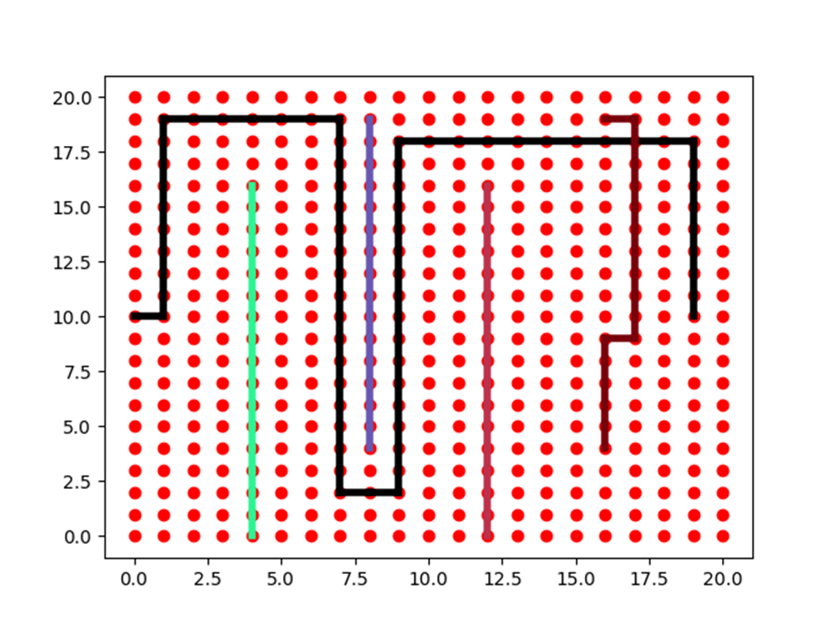
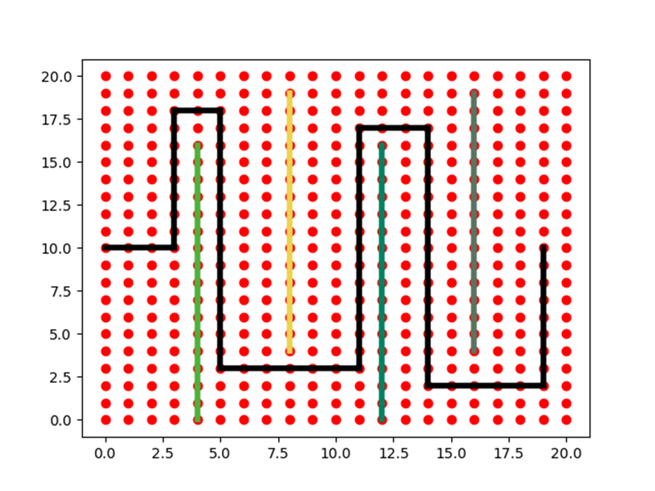

# Evolutionary soldering
This repository contains a Python implementation of a genetic algorithm designed to optimize the connections of soldering points on a PCB (Printed Circuit Board). By leveraging genetic principles such as selection, crossover, and mutation, this algorithm intelligently evolves a population of potential solutions, iteratively improving the routing layout for efficiency and performance.

## Constraints
There are several conditions that need to be met:
 - The board consists of a single layer in the shape of a rectangle, with fixed dimensions
 - The points lie at the intersections of the grid
 - physical connections can only be made along the superimposed grid on the surface of the board, made up of squares with sides equal to 1

The solution should not have any of the paths intersect or extend beyond the board. In addition, their length should be minimized

## Solution
The algorithm used is based on the classic scheme of the genetic algorithm. 
The basic step is to create a new population of individuals, or 
potential solutions, on the basis of selected, best-adapted 
adapted representatives of the previous generation. A simple pseudocode of the algorithm is presented below:
```
BEGIN
Init population
Calculate fitness
    WHILE NOT satisfying solution found
        Select individuals
        Cross indviduals
        Mutate
        Calculate fitness
    ENDWHILE
END
```

### Fitness function
The fitness function calculates the degree of his maladaptation. This value is determined by the weighted sum of the penalties for 
violations of restrictions and parameters, denoted as **k<sub>i</sub>**:
 - **k<sub>1</sub>** - the number of intersections
 - **k<sub>2</sub>** - total length of paths
 - **k<sub>3</sub>** - total number of segments forming paths
 - **k<sub>4</sub>** - the number of paths outside the board
 - **k<sub>5</sub>** - the summed length of paths outside the board

The fitness (maladaptation) function is defined as follows:

$$\sum_{i=1}^5 k_i w_i$$

where **w<sub>i</sub>** is a predefined weight of the constraint. The bigger the value of **f**, the worse a selected individual is.

The algorithm utilizes SAW – Stepwise Adaptation of Weights. If you want to read more about this mechanism, please refer to [this notebook](notebook.pdf).

## Analysis
You can read more about the solution and performed tests [here](report.pdf).

## Example solutions
Below you can see an example solutions of the same problem generated by the program. The second one is more optimized than the first:


